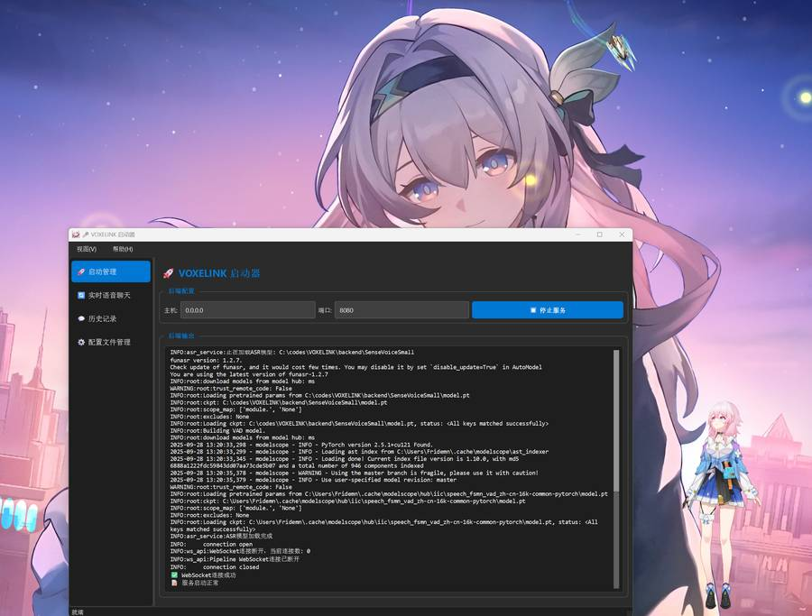
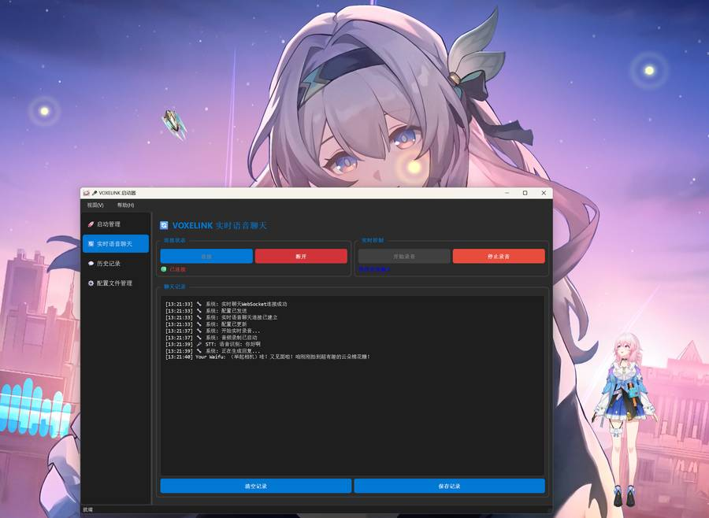

# VOXELINK

VOXELINK，即 Voice-link，是可以和二次元老婆进行实时语音聊天（当你说完话后大概 2s 就可以听到美妙的回应了）的项目，集成了语音识别(STT)、语音合成(TTS)和大语言模型(LLM)，目前主推三月~~妻~~。


## ✨ 主要特性

- **实时语音识别 (STT)** - 使用 SenseVoice，能够快速识别用户语音并转化为文本
- **高质量语音合成 (TTS)** - 使用 GPT-SoVITS，语气比较自然
- **大语言模型（LLM）** - 使用 openai 库，可以自行更换供应商
- **Live2D** - 集成Live2D角色显示，可自行更换模型




## 🚀 快速开始

### 系统要求

- **操作系统**: Windows 10/11
- **Python**: 3.10 或更高版本
- **显存**：6GB+

### 安装步骤

#### 1. 克隆项目

```bash
git clone https://github.com/Fridemn/VOXELINK.git
cd VOXELINK
```

#### 2. 创建虚拟环境(conda)

```bash
conda create -n voxelink python=3.10 -y
conda activate voxelink
cd ..
```

#### 3. 安装依赖

```bash
pip install -r requirements.txt

# 安装 PyTorch (根据你的CUDA版本选择)
pip3 install torch torchvision torchaudio --index-url https://download.pytorch.org/whl/cu121
```

#### 4. 下载模型文件

```bash
# 下载 STT 模型
cd backend
git lfs install
git clone https://huggingface.co/FunAudioLLM/SenseVoiceSmall
# 下载 GPT-SoVITS 相关模型，太麻烦了，仙人指路：https://github.com/RVC-Boss/GPT-SoVITS
# 根据喜好自行收集 Live2D 模型并放置在 static/assets/live2d/<your_character> 目录
```

### 配置文件
将backend/config_example.json复制一份为backend/config.json，修改其中的OpenAI API Key等配置项。

### 启动应用

#### 方式3: 使用GUI启动器

```bash
python gui.py
```

#### 只启动后端（二次开发）

```bash
# 只启动后端服务
python start.py

# 启动后端 + STT服务
python start.py --enable-stt

# 启动后端 + TTS服务
python start.py --enable-tts

# 启动所有服务
python start.py --enable-stt --enable-tts

# 指定端口启动
python start.py --port 8080
```
## ❤️贡献
欢迎任何 Issues/Pull Requests！只需要将你的更改提交到此项目 ：)

---

⭐ 如果这个项目对你有帮助，请给我们一个星标！